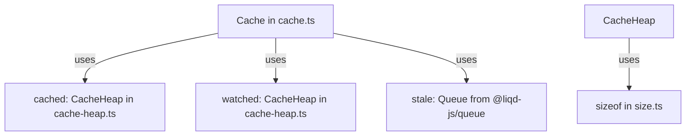

# Old Cache Library Analysis

This document provides a detailed analysis of the functionalities, architecture, and inner workings of the legacy cache implementation located in `cache/old/`.

---

## 1. Overview & Key Capabilities

The legacy cache is a memory-efficient, self-tuning, dual-heap key-value store with the following features:
- **Two-Queue (2Q) Inspired Architecture**: It maintains an active cache (`cached`) for objects containing actual data and a tracking cache (`watched`) for metadata (keys and access history of items that are not currently cached). This prevents cache pollution by infrequently accessed items.
- **Frequency & Recency Scoring (LFU/LRU hybrid)**: Access history is recorded in time-bucketed segments, and items are scored dynamically. Recent accesses are weighted differently than older accesses.
- **Memory-Bounded Eviction**: The cache can limit both the maximum number of items (`maxItems`) and the maximum size in bytes (`maxSize`). Memory consumption is estimated using a custom recursive size calculator.
- **Time-To-Live (TTL)**: Items can be set to expire after a certain amount of time (`staleTime`), managed via a queue.

---

## 2. File-by-File Architecture

The library is split into three files:

1. **[`size.ts`](file:///Users/tomaskorenko/Projects/Github/webergency-utils/cache/old/size.ts)**: Estimates the size of JavaScript values in memory (in bytes).
2. **[`cache-heap.ts`](file:///Users/tomaskorenko/Projects/Github/webergency-utils/cache/old/cache-heap.ts)**: A subclass of `@liqd-js/heap` that tracks the memory size of its items dynamically.
3. **[`cache.ts`](file:///Users/tomaskorenko/Projects/Github/webergency-utils/cache/old/cache.ts)**: The main entry point and driver class managing the cache lifecycle, statistics, promotion, and eviction.



---

## 3. How It Works Under the Hood

### A. Size Estimation (`size.ts`)
The `sizeof` function estimates the memory footprint of any JavaScript value:
- **Primitive Types**:
  - `number`: 8 bytes.
  - `boolean`: 4 bytes.
  - `undefined` / `null`: 2 bytes.
  - `string`: 2 bytes baseline + 4 bytes for every 4 characters: `2 + 4 * Math.ceil(str.length / 4)`.
  - `symbol`: `(symbolStringLength - 8) * 2`.
  - `bigint`: Byte length of its string representation.
- **Arrays & Collections**:
  - Typed arrays (`Int8Array`, `Float64Array`, etc.) are calculated by multiplying their length by their respective element size.
  - Standard arrays, `Set`, and `Map` are traversed recursively to sum up the size of their elements/keys/values.
- **Objects**:
  - Properties are traversed recursively. To prevent infinite recursion, a `Set` of `visited` objects is maintained.
  - The size of an object is the sum of its keys' string sizes plus the size of their values.

---

### B. Dynamic Size-Aware Heap (`cache-heap.ts`)
`CacheHeap` inherits from `@liqd-js/heap` (a min-heap) and enhances it with:
- **Dynamic Size Tracking**: Overrides `push`, `update`, `pop`, and `delete` to increment/decrement a `heapSize` accumulator.
- **`dataProperty` Filtering**: If configured with a `dataProperty` (e.g., `'data'`), the heap only measures the size of that specific nested property rather than the entire wrapped entry. For example, in the `cached` heap, it only measures the size of `item.data` instead of the metadata wrapper.
- **Memory Overhead Calculation**:
  `memory()` returns: `heapSize + size * (itemMetaSize + 16)`
  where `16` bytes represents the heap indexing pointer overhead per item.
- **Random Tail Selection (`randomTailItem`)**:
  Used to select an element from the worst performing items (those with lower scores) without strictly picking the absolute worst.
  It sorts the heap (if not already sorted) and returns a random item from the last $N$ items of the internal array, where:
  $$N = \lceil\log_2(\text{heap size})\rceil$$

---

### C. Time-Bucketed Seek History & Scoring (`cache.ts`)

#### 1. Seek History
Each cached and watched key is associated with a seek history array:
- `seeks: Uint16Array` of size `precision` (default: 10 buckets).
- A global timer runs every `watchTime` seconds (default: 300s).
- On each tick, the current bucket index `this.index` is rotated: `(this.index + 1) % 10`.
- The seeks for all keys in the new bucket are reset to 0.
- When `get(key)` is called, the seek counter for the current bucket `seeks[this.index]` is incremented (capped at `0xFFFF`).

#### 2. Scoring Formula
The popularity score of a key is a weighted sum of its seeks across all 10 buckets, calculated as:
```typescript
protected score( value: WatchedValue | CachedValue<any> ): number
{
    let score = 0;
    for ( let i = 0; i < this.precision; i++ )
    {
        score += value.seeks[(this.precision + this.index - i) % this.precision] * (1 << i);
    }
    return score;
}
```
**Weighting Analysis**:
- `i = 0` (current bucket) has weight $1 \ll 0 = 1$.
- `i = 1` (one bucket ago) has weight $1 \ll 1 = 2$.
- `i = 9` (nine buckets ago) has weight $1 \ll 9 = 512$.
- *Note*: Older buckets receive exponentially higher weights. This weights long-term popularity far more than short-term spikes.

---

### D. The Active vs. Watched Promotion Cycle
The cache splits memory between the active `cached` heap (holds data, occupies ~90% of the memory boundary) and the `watched` heap (holds metadata only, occupies ~10% of the memory boundary).

```
   [ Client Requests Key ]
              │
      ┌───────┴───────┐
      ▼               ▼
 [ In Cache? ]   [ In Watched? ]
  Yes:            Yes:
   - Return data   - Inc seeks
   - Inc seeks     - Ret undefined
                   No:
                   - Create entry in Watched (if space)
```

#### 1. Eviction & Promotion Rules
- **Adding a new key (`set`)**:
  1. If already in `cached`: Update value, refresh expiration/stale time, increment seeks, and re-heapify.
  2. If in `watched`: Attempt to promote it to `cached` with the new value. If successful, delete from `watched`.
  3. If not present: Create a temporary cache element. If it fits or is better than the worst item in `cached`, push it to `cached`. Otherwise, discard the data and add its metadata to `watched`.
- **Active Cache Eviction (`loadToCache`)**:
  - If the cache has space (`cached.size < maxItems` and memory size fits under `maxSize`), the item is added.
  - If full, the cache retrieves the worst item using `cached.top()` (the minimum element).
  - If `score(worst) < score(new_item)`, the worst item is evicted (removed from `cached` and `stale` queue) and the new item is inserted.
- **Watched Eviction (`addToWatched`)**:
  - If `watched` is full, it calls `watched.randomTailItem()` to find an item to evict.
  - If `score(worst_watched) < score(new_watched)`, the worst watched item is evicted.

---

### E. Time-Based Expiration (TTL)
- If `staleTime` is provided, a queue (`@liqd-js/queue`) tracks the expiration sequence.
- During any read (`get`) or write (`set`), `removeStale()` is called first.
- It inspects the oldest items in the queue. If their `stale` time has passed:
  1. The item is popped from the queue.
  2. The item is deleted from the `cached` heap.
  3. Its metadata (`id` and `seeks`) is moved to the `watched` list (to preserve popularity stats in case it is requested again).

---

## 4. Key Observations & Potential Bugs

### 1. Reverse Eviction in Watched Heap (Key Bug)
In `CacheHeap`, the heap is sorted in ascending order of score because the comparator is `(a, b) => score(a) - score(b)`.
- Under this comparator, `this.data[0]` contains the lowest scoring element (worst), and `this.data[this.data.length - 1]` contains the highest scoring element (best).
- `randomTailItem()` is implemented as:
  ```typescript
  return this.data[this.data.length - 1 - Math.floor(Math.random() * tail_length)];
  ```
  This selects elements from the *end* of the array (indices near `length - 1`), which correspond to the **highest scoring elements** (the most frequently requested keys).
- In `addToWatched`, it evicts this item if its score is lower than the new item:
  ```typescript
  const worst = this.watched.randomTailItem();
  if ( worst && this.score( worst ) < this.score( element ) ) { ... }
  ```
  Consequently:
  - The watched cache evicts its **best/most popular** items instead of its worst.
  - The watched list becomes filled with low-popularity keys, while high-popularity keys that overflowed from the active cache are discarded.

### 2. Global Interval Memory Sweep
The periodic interval resetting seek history iterates over all keys in both heaps:
```typescript
setInterval(() => {
    this.index = ( this.index + 1 ) % this.precision;
    for( let item of [...this.cached.values(), ...this.watched.values()] ) {
        item.seeks[this.index] = 0;
    }
}, this.watchTime);
```
- If the cache contains tens or hundreds of thousands of keys, copying them into a flat array via `[...values()]` and loop-mutating them every `watchTime` seconds will cause CPU spikes and block the event loop.
- It also prevents these objects from being optimized by the JS engine due to frequent properties modification inside an interval.
